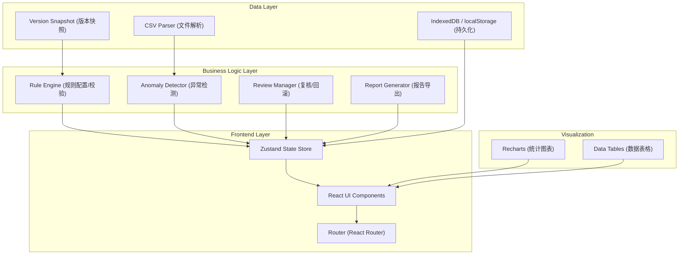
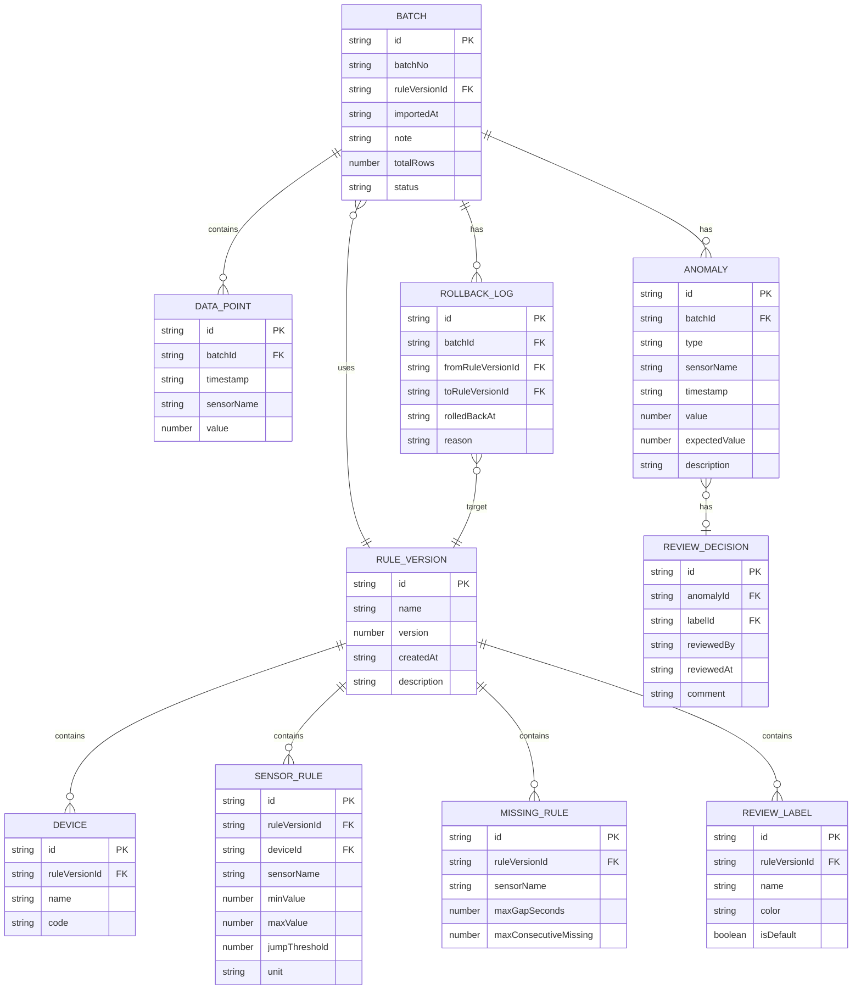

## 1. 架构设计



## 2. 技术描述

- **前端框架**：React 18 + TypeScript 5
- **构建工具**：Vite 5
- **样式方案**：Tailwind CSS 3
- **状态管理**：Zustand 4
- **路由**：React Router DOM 6
- **图表库**：Recharts 2
- **图标**：Lucide React
- **后端**：无（纯前端应用，数据本地持久化）
- **数据存储**：IndexedDB（主存储）+ localStorage（轻量配置）
- **数据格式**：CSV 导入，JSON 快照，CSV/HTML 报告导出

## 3. 路由定义

| 路由 | 页面 | 用途 |
|------|------|------|
| `/` | Dashboard | 仪表盘，统计摘要、最近批次、快速入口 |
| `/rules` | Rules | 规则配置页，设备/传感器/阈值/缺失规则/标签管理 |
| `/import` | Import | CSV 数据导入页，上传、校验、批次信息 |
| `/review/:batchId` | Review | 异常复核页，候选异常列表、打标、上下文图表 |
| `/history` | History | 历史记录页，批次列表、版本回滚 |
| `/report/:batchId` | Report | 报告页，统计图表、异常表格、导出 |

## 4. 数据模型

### 4.1 ER 图



### 4.2 核心类型定义（TypeScript）

```typescript
// 规则相关
interface RuleVersion {
  id: string;
  name: string;
  version: number;
  createdAt: string;
  description: string;
  devices: Device[];
  sensorRules: SensorRule[];
  missingRules: MissingRule[];
  reviewLabels: ReviewLabel[];
}

interface Device {
  id: string;
  name: string;
  code: string;
}

interface SensorRule {
  id: string;
  deviceId: string;
  sensorName: string;
  minValue: number;
  maxValue: number;
  jumpThreshold: number;
  unit: string;
}

interface MissingRule {
  id: string;
  sensorName: string;
  maxGapSeconds: number;
  maxConsecutiveMissing: number;
}

interface ReviewLabel {
  id: string;
  name: 'confirmed_fault' | 'false_positive' | 'ignored' | string;
  color: string;
  isDefault: boolean;
}

// 数据批次
interface Batch {
  id: string;
  batchNo: string;
  ruleVersionId: string;
  importedAt: string;
  note: string;
  totalRows: number;
  status: 'importing' | 'detecting' | 'reviewing' | 'completed' | 'rolled_back';
  dataPoints: DataPoint[];
  anomalies: Anomaly[];
  decisions: ReviewDecision[];
  rollbackLogs: RollbackLog[];
}

interface DataPoint {
  id: string;
  timestamp: string;
  sensorName: string;
  value: number;
}

type AnomalyType = 'missing' | 'out_of_range' | 'jump' | 'duplicate_timestamp';

interface Anomaly {
  id: string;
  type: AnomalyType;
  sensorName: string;
  timestamp: string;
  value: number | null;
  expectedValue?: number;
  previousValue?: number;
  nextValue?: number;
  description: string;
}

interface ReviewDecision {
  id: string;
  anomalyId: string;
  label: 'confirmed_fault' | 'false_positive' | 'ignored';
  reviewedAt: string;
  comment?: string;
}

interface RollbackLog {
  id: string;
  fromRuleVersionId: string;
  toRuleVersionId: string;
  rolledBackAt: string;
  reason: string;
}
```

## 5. 核心模块设计

### 5.1 异常检测引擎

```
输入：DataPoint[] + RuleVersion
输出：Anomaly[]

检测策略：
1. duplicate_timestamp：按 (sensorName, timestamp) 分组，计数 > 1 的标记
2. out_of_range：对每个 DataPoint，匹配 SensorRule，检查 minValue <= value <= maxValue
3. jump：对同一传感器按时间排序，计算 |value[i] - value[i-1]| > jumpThreshold
4. missing：对同一传感器按时间排序，检查相邻时间戳 gap > maxGapSeconds
```

### 5.2 版本管理机制

```
规则版本：
- 每次保存规则创建新 RuleVersion（version 自增）
- 批次绑定创建时使用的 ruleVersionId
- 回滚：为批次新建 RollbackLog，可选重新检测异常
- 已接受批次的 ReviewDecision 永不删除，仅追加
```

### 5.3 存储策略

```
IndexedDB (Dexie.js) 表：
- rule_versions: 规则版本快照
- batches: 批次主数据
- data_points: 数据点（按 batchId 分片）
- anomalies: 异常记录
- review_decisions: 复核决策

localStorage：
- currentRuleVersionId: 当前选中规则版本
- ui_preferences: 表格列宽、筛选偏好
```
