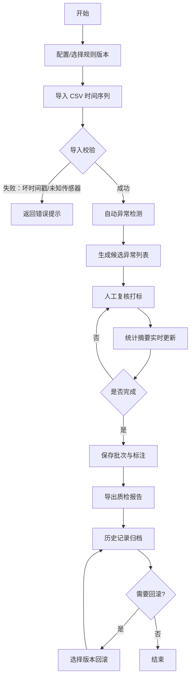

## 1. 产品概述

车间传感器质检分析工具，面向车间质量工程师和设备维护人员，用于对传感器采集的时间序列数据进行自动化异常检测和人工复核，确保数据质量可靠，支持历史追溯与报告导出。

- 解决的问题：传统传感器质检依赖人工逐条检查，效率低、易遗漏、难以追溯
- 核心价值：规则驱动的自动化检测 + 人工复核闭环，提升质检效率与准确性
- 目标用户：车间质量工程师、设备维护技术员、质检主管

## 2. 核心功能

### 2.1 用户角色

| 角色 | 注册方式 | 核心权限 |
|------|----------|----------|
| 质检工程师 | 本地工具（无需注册） | 配置规则、导入数据、复核异常、导出报告、查看历史 |

### 2.2 功能模块

1. **仪表盘**：批次统计摘要、最近批次列表、快速操作入口
2. **规则配置**：设备管理、传感器范围配置、跳变阈值、缺失规则、复核标签
3. **数据导入**：CSV 时间序列导入、导入校验、批次管理
4. **异常检测与复核**：候选异常列表、分类筛选、人工打标、批量操作
5. **历史记录**：批次列表、规则版本对比、回滚操作
6. **报告导出**：CSV/PDF 报告、统计图表

### 2.3 页面详情

| 页面名称 | 模块名称 | 功能描述 |
|----------|----------|----------|
| 仪表盘 | 统计卡片 | 展示批次总数、异常总数、已确认故障、误报率等关键指标 |
| 仪表盘 | 最近批次 | 表格展示最近 10 个批次的导入时间、数据量、异常数 |
| 仪表盘 | 快速入口 | 跳转到数据导入、规则配置、历史记录 |
| 规则配置 | 设备管理 | 增删改设备、关联传感器列表 |
| 规则配置 | 传感器规则 | 配置传感器值范围（最小/最大）、跳变阈值 |
| 规则配置 | 缺失规则 | 配置缺失判定条件（连续缺失点数、时间间隔阈值） |
| 规则配置 | 复核标签 | 管理复核标签（确认故障、误报、忽略）及颜色配置 |
| 规则配置 | 版本管理 | 保存规则版本快照、查看历史版本 |
| 数据导入 | CSV 上传 | 拖拽或点击上传 CSV 文件，支持列映射预览 |
| 数据导入 | 导入校验 | 校验时间戳格式、传感器合法性、重复数据等 |
| 数据导入 | 批次信息 | 输入批次编号、备注，展示导入统计 |
| 异常复核 | 检测结果 | 按类型分类展示：缺失、越界、跳变、重复时间戳 |
| 异常复核 | 筛选器 | 按异常类型、传感器、复核状态筛选 |
| 异常复核 | 人工打标 | 单条/批量标记为确认故障、误报、忽略 |
| 异常复核 | 详情查看 | 点击异常查看上下文数据图表 |
| 异常复核 | 实时统计 | 复核标签变更时实时更新统计摘要 |
| 历史记录 | 批次列表 | 所有历史批次，支持按时间、批次号搜索 |
| 历史记录 | 版本回滚 | 选择规则版本回滚到该批次，记录回滚痕迹 |
| 历史记录 | 标注保护 | 已接受批次的旧标注不可被清除 |
| 报告导出 | 统计图表 | 异常类型分布饼图、各传感器异常数柱状图、趋势折线图 |
| 报告导出 | 数据表格 | 完整异常清单表格 |
| 报告导出 | 导出操作 | 导出 CSV 报告、打印预览 |

## 3. 核心流程

用户登录工具后，首先配置或确认规则版本，然后导入 CSV 数据批次，系统自动检测四类异常（缺失、越界、跳变、重复时间戳），生成候选异常列表。用户逐条或批量复核打标，统计摘要实时更新。完成后导出质检报告，所有数据保存在本地，支持后续回滚和再次导出同一批次时数据保持一致。

## 4. 用户界面设计

### 4.1 设计风格

- 主色调：工业蓝 `#1e40af`（专业可信） + 警示橙 `#f97316`（异常提醒）
- 辅助色：成功绿 `#10b981`、错误红 `#ef4444`、中性灰 `#64748b`
- 按钮风格：圆角 6px，主按钮实心填充 + hover 阴影，次要按钮边框样式
- 字体：中文系统字体栈（PingFang SC、Microsoft YaHei）+ 等宽数字字体（数据展示）
- 布局风格：顶部导航栏 + 左侧分类面板 + 主内容区卡片式布局
- 图标风格：Lucide 线性图标，与工业质检场景契合
- 整体风格：工业数据面板风，信息密度高但层次分明，强调数据可读性

### 4.2 页面设计概述

| 页面名称 | 模块名称 | UI 元素 |
|----------|----------|---------|
| 仪表盘 | 统计卡片 | 彩色指标卡片带图标，数字醒目，环比趋势箭头 |
| 仪表盘 | 最近批次 | 紧凑数据表格，斑马纹，异常数列高亮 |
| 规则配置 | 配置表单 | 分组卡片布局，数值输入带步进器，规则条件行可增删 |
| 规则配置 | 版本时间线 | 垂直时间线，每个版本节点显示时间与摘要 |
| 数据导入 | 上传区域 | 虚线边框拖拽区，文件拖入高亮，预览表格 |
| 异常复核 | 异常列表 | 表格行按类型着色标签，状态徽章，悬停展开上下文 |
| 异常复核 | 上下文图表 | 小型时间序列折线图，高亮异常点 |
| 历史记录 | 批次表格 | 支持列排序，回滚按钮带二次确认弹窗 |
| 报告导出 | 图表区 | 彩色饼图 + 柱状图，网格背景 |

### 4.3 响应性

- Desktop-first 设计，针对 1440px 及以上宽屏优化
- 表格区域支持横向滚动，保证在 1024px 屏上仍可浏览
- 侧边栏在窄屏下可折叠为图标模式

### 4.4 动效与交互

- 页面切换：淡入淡出过渡
- 数据加载：骨架屏占位 + 轻微 pulse 动画
- 异常标记：打标成功后行背景色瞬时闪烁对应状态色
- 批量操作：进度条动画 + Toast 反馈
- Tooltip：所有图标按钮悬停显示操作说明
